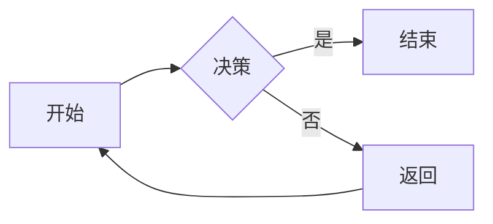
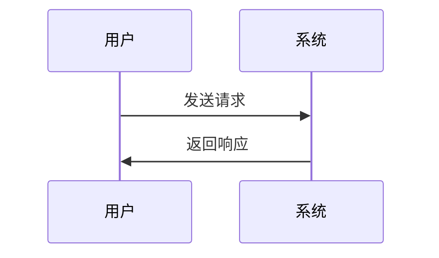
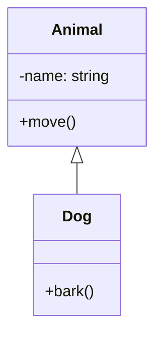

# Mermaid 渲染和预览功能实现

## 概述

本实现在 OpenChatWorkbench 中添加了对 Mermaid 图表的支持，允许用户在 Markdown 消息中使用 ````mermaid` 代码块来渲染各种类型的图表。

## 实现详情

### 1. 新建文件

#### `src/modules/webcomponents/ocw-mermaid-component.ts`
- 基于 Lit 框架创建的 Web Component
- 负责 Mermaid 图表的动态加载、初始化和渲染
- 包含加载状态、错误处理和 SVG 渲染
- 支持响应式样式，包括自定义 CSS 变量用于主题适配

**关键特性：**
- 动态导入 mermaid 库，避免首屏加载时间增加
- 异步渲染流程，支持加载指示器
- 完善的错误处理，显示错误消息而非崩溃
- 自动生成唯一的图表 ID，支持单一页面多个图表

### 2. 修改文件

#### `src/components/MarkdownRenderer.vue`
**添加：**
- 导入新的 Mermaid Web Component
- 在 `update()` 函数中添加 Mermaid 块检测逻辑
  - 检测 `language="mermaid"` 属性的代码块
  - 提取 Mermaid 代码内容
  - 替换为 `ocw-mermaid-component` Web Component

**工作流程：**
```
markdown代码块 (```mermaid)
  ↓
markdown-it 解析并生成 <code class="language-mermaid"> 
  ↓
MarkdownRenderer 检测 language="mermaid"
  ↓
替换为 <ocw-mermaid-component type="mermaid" content="...">
  ↓
Web Component 异步加载和渲染 SVG
```

#### `src/styles/markdown-beautify.css`
**添加：**
- Mermaid 组件的样式定义
- CSS 变量支持（`--mermaid-bg`, `--mermaid-border`, `--mermaid-label`, `--mermaid-content-bg`）
- SVG 自适应布局样式

## 使用方法

在 Markdown 消息中使用 Mermaid 代码块：

### 1. 流程图 (Flowchart)

````markdown

````

### 2. 时序图 (Sequence Diagram)

````markdown

````

### 3. 类图 (Class Diagram)

````markdown

````

### 4. 其他支持的图表类型

- 状态图 (State Diagram)
- 甘特图 (Gantt Chart)
- 思维导图 (Mind Map)
- C4 图 (C4 Diagram)
- 等等

## 技术细节

### 依赖关系

- `mermaid@^11.13.0` - 已存在于 package.json
- `lit@^3.3.2` - Web Component 框架
- `ant-design-vue` - 错误消息通知

### 配置

Mermaid 通过以下配置初始化：

```typescript
mermaid.initialize({
    startOnLoad: false,      // 不自动加载，使用手动渲染
    theme: 'default',        // 默认主题
    securityLevel: 'loose',  // 安全级别（可根据需要调整）
});
```

### 生命周期

1. **组件创建** → 属性设置
2. **firstUpdated** → 异步加载 Mermaid 库
3. **renderMermaid** → 调用 Mermaid 的 render 方法
4. **DOM 更新** → 设置 SVG 内容到 shadowRoot

### 错误处理

- 缺少内容 → 显示错误提示："No mermaid diagram content provided"
- 库加载失败 → 显示错误提示："Failed to load mermaid library"
- 渲染失败 → 显示具体错误信息，并在控制台打印详细日志

## 样式定制

可以通过 CSS 变量定制外观：

```css
ocw-mermaid-component[type="mermaid"] {
    --mermaid-bg: #ffffff;              /* 背景色 */
    --mermaid-border: #e5e5e5;          /* 边框色 */
    --mermaid-label: #666;              /* 标签文本色 */
    --mermaid-content-bg: #fafbfc;      /* 内容区背景 */
}
```

## 验证清单

✅ Web Component 创建并注册  
✅ MarkdownRenderer 集成  
✅ 样式定义  
✅ TypeScript 编译无错误  
✅ 构建成功  
✅ 多个图表类型支持  
✅ 错误处理机制  

## 后续优化建议

1. **主题适配** - 根据应用主题动态设置 Mermaid 主题（dark/light）
2. **性能优化** - 对于包含大量图表的页面考虑虚拟化或懒加载
3. **交互功能** - 添加缩放、下载 SVG 等交互功能
4. **安全性** - 对 Mermaid 代码进行更严格的清理或沙箱化
5. **预览工具** - 在 settings 中添加 Mermaid 预览编辑器

## 测试方法

1. 在聊天应用中输入包含 Mermaid 代码块的消息
2. 验证图表正确渲染
3. 测试多种图表类型（flowchart, sequence, class 等）
4. 验证错误处理（输入无效语法应显示错误）
5. 检查样式在浅色和深色主题中的表现（需要主题集成）

## 文件成本

- 新增行数：185+ 行（ocw-mermaid-component.ts）
- 修改行数：12+ 行（MarkdownRenderer.vue）
- 新增样式：10+ 行（markdown-beautify.css）
- 总计：约 207+ 行代码

## 相关 Issue

实现此功能以解决：https://github.com/clspd/OpenChatWorkbench/issues/23

---

**实现时间**：2026-03-24  
**实现者**：GitHub Copilot  
**状态**：✅ 完成
